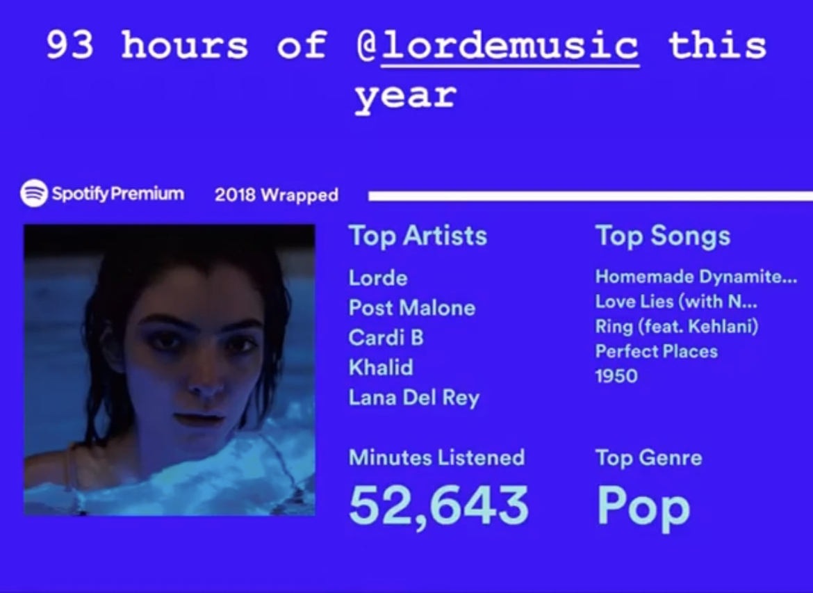

| Title  | Written by |  Date |
| ------------- | ------------- | ------------- |
| Why I Love Lorde  | Michelle Cao  |  03/05/2021 |


# Introduction: Lorde's Happy-Sadness

In 2018, I was obsessed with [Lorde](https://en.wikipedia.org/wiki/Lorde). I liked her breakout hit [Royals](https://www.google.com/url?sa=t&rct=j&q=&esrc=s&source=web&cd=&cad=rja&uact=8&ved=2ahUKEwiFlu7h2Z7vAhWkm-AKHZ7DCzMQyCkwAHoECAYQAw&url=https%3A%2F%2Fwww.youtube.com%2Fwatch%3Fv%3DLFasFq4GJYM&usg=AOvVaw2qGWPnUmXVOH0jOXSZrhEk) well enough but couldn't get enough of her second album, [Melodrama](https://www.youtube.com/watch?v=zJuygTp7ydE&list=PLvm6B0LWgqu9pWrYmmC-6ETs7yDcfHyl9). She was with me on runs, on drives, in the shower, and before bed. Her music made me feel  electric and reflective all at once. And in that year alone, I listened to 93 hours of the albums, Pure Heroine and Melodrama. 



To this day, one of my most-played songs of all time is the Homemade Dynamite remix with Post Malone, Khalid, and SZA. On one night out, I even made a rideshare driver put it on repeat for 30 minutes. Among her other songs, I also really love Supercut, Green Light, Buzzcut Season, and Perfect Places. 

In thinking about why I like what I like and what it is about Lorde's music that connects with me, I realized that I didn't even know the answer to a basic question: is her music happy or sad? This [NPR article](https://www.npr.org/2018/08/31/638897130/lorde-is-the-21st-centurys-author-of-adolescent-evolution) describes her as minimalistic and dark pop, while this [Reddit thread](https://www.reddit.com/r/lorde/comments/gojch3/happy_songs/) decides her music is "happy sad, kind of like nostalgia." Was I drawn to her happy-sadness, nostalgia, or some other emotion I couldn't identify?

I wanted to see if I could find an answer to this question before [her next album release](https://www.nme.com/en_asia/news/music/lordes-third-album-title-is-inspired-by-her-trip-to-antarctica-2840657). For this analysis, I will be using R to analyze the Pure Heroine and Melodrama albums, and ignoring any EP's for simplicity and to prevent duplication.

## Loading Song Lyrics with Genius
First, I will load all the relevant packages and libraries needed.
```
library(tidyverse)
library(tidytext)
library(genius)  #to download lyrics from the Genius library
library(textdata)
library(wordcloud)
library(tm)
library(scales)  #for percentage scales in ggplot
library(ggraph)  #for network analysis
library(igraph)  #for network analysis
library(widyr) # for correlations between songs
```
Next, I'll be using Josiah Parry's [Genius](https://github.com/JosiahParry/genius) package to easily access song lyrics. He also [provides a great discussion and resource](https://josiahparry.com/post/2019-05-08-genius-learnr-tutorial/) for using his package.
```
lorde <- tribble(~ artist, ~ title, ~ type,
                "Lorde", "Pure Heroine","album",
                "Lorde", "Melodrama", "album")

lorde_lyrics <- lorde %>% add_genius(artist, title, type) 

lorde_lyrics_unnest_stop <- lorde_lyrics %>% unnest_tokens(word, lyric) %>% anti_join(stop_words)

lorde_lyrics_by_album <- factor(lorde_lyrics_unnest_stop, levels = c("Pure Heroine", "Melodrama"))
```

# Word Counts and Clouds
Now that we have the lyrics downloaded, it's time to look at some statistics and get to know the data.
```
# To change the column title to "word_count"
colnames(words_per_track)[colnames(words_per_track) == "length(word)"] <- "word_count"

# To get the number of words per song and sort from most to least
words_per_track_bar <- ggplot(words_per_track, aes(x = reorder(track_title, word_count),
                                                  y = word_count)) + 
                                                geom_text(aes(label = word_count), vjust = 4, size = 2.5) +
                                                geom_bar(stat = "identity", fill = "blue") + 
                                                ggtitle("Word Count Per Track") + 
                                                ylab("Word Count") + xlab("Track Title") + 
                                                theme_minimal() + coord_flip()

words_per_track_bar
```

At a length of 6:07, Hard Feelings/Loveless is the longest song of both albums and makes sense as the song with the most words. Similarly, Liability (Reprise) is the shortest song from both albums and is found to be the song with the least number of words.

```
# To get the most used word
lorde_lyrics_unnest_stop %>% count(word, sort = TRUE)
```

Running the code above tells us that Lorde's five most-used words across both albums are:

- boom
- love
- call
- people
- yeah

While this doesn't tell us too much, it does imply a fairly consistent theme of love, or at least the mention of it.

```
# Create raw corpus from genius lyrics
corpus_raw <- Corpus(VectorSource(lorde_lyrics$lyric))

# To lowercase
corpus <- tm_map(corpus_raw, content_transformer(tolower))

# Strip whitespace
corpus <- tm_map(corpus, stripWhitespace)

# Remove punctuation
corpus <- tm_map(corpus, removePunctuation)

# Remove stopwords
corpus <- tm_map(corpus, removeWords, stopwords("english"))

# Stem the document
corpus <- tm_map(corpus, stemDocument)

# Create document term matrix
dtm <- (DocumentTermMatrix(corpus))

# Tidy dtm
corpus_tidy <- tidy(dtm)
    corpus_tidy %>%
    bind_tf_idf(term, document, count) %>%
    arrange(desc(tf_idf))

cloud <- wordcloud(corpus, max.words = 100, random.order = FALSE)
```


# Sentiment Analysis
```
# Analysis by album
lorde_lyrics_bing <- lorde_lyrics_unnest_stop %>% inner_join(get_sentiments("bing")) %>%
    count(title, index = line, sentiment) %>% spread(sentiment, n, fill = 0) %>%
    mutate(sentiment = positive - negative)
    
lorde_lyrics_bing_by_album <- factor(lorde_lyrics_bing, levels = c("Pure Heroine", "Melodrama"))

lorde_lyrics_bing_album <- ggplot(lorde_lyrics_bing, aes(index, sentiment, fill = title)) +
    geom_col(show.legend = FALSE) + facet_wrap(~title, ncol = 3, scales = "free_x") + theme_minimal() + 
    scale_fill_manual(values = c("#0000ff", "#000000"))

lorde_lyrics_bing_album
```


```
# Raw number count of negative words per album
lorde_lyrics_bing_sent <- lorde_lyrics_unnest_stop %>%
    inner_join(get_sentiments("bing"))

lorde_lyrics_bing_sent_title <- lorde_lyrics_bing_sent %>%
    subset(sentiment == "negative") %>%
    group_by(title) %>% summarise(sentiment = n()) %>%
    ungroup()

lorde_lyrics_bing_sent_title_bar <- lorde_lyrics_bing_sent_title %>%
    ggplot(aes(x = title, y = sentiment)) + geom_bar(stat = "identity") +
    ggtitle("Negative Word Count Per Album") + theme_minimal() + xlab("Album")

lorde_lyrics_bing_sent_title_bar
```


```
# Analysis by album and song
lorde_sentiment_2 <- lorde_lyrics_unnest_stop %>% inner_join(get_sentiments("bing")) %>% 
    count(title, track_title, sentiment) %>% spread(sentiment, n, fill = 0) %>%
    mutate(sentiment = positive - negative)

lorde_sentiment_2$title <- factor(lorde_sentiment_2$title, levels = c("Pure Heroine", "Melodrama"))

sent_2 <- lorde_sentiment_2 %>% ggplot(aes(reorder(track_title, sentiment), sentiment, fill = title)) +
    geom_col(show.legend = FALSE) + facet_wrap(~title, ncol = 3, scales = "free") +
    labs(x = NULL, y = "Sentiment", title = "Lorde's songs ranked by sentiment") + 
    theme(plot.title = element_text(size = 13, hjust = 0.4, face = "bold"), 
         axis.title.y = element_text(hjust = 0.05, size = 7), 
         axis.title.x = element_text(size = 8)) + theme_minimal() + coord_flip() 

sent_2 + scale_fill_manual(values = c("#000000","#0000ff"))
```


```
# Analysis by emotion according to dictionary chosen

# NRC lexicon
lorde_nrc <- lorde_lyrics_unnest_stop %>% 
    inner_join(get_sentiments("nrc")) %>% count(word, sentiment, sort = TRUE) %>% 
    ungroup() %>% group_by(sentiment) %>% top_n(10) %>% ungroup() %>% 
    mutate(word = reorder(word, n)) %>% ggplot(aes(word, n, fill = sentiment)) +
    geom_col(show.legend = FALSE) + facet_wrap(~sentiment, scales = "free_y") +
    labs(y = "Contribution to sentiment", x = NULL) + theme_minimal() + coord_flip()

lorde_nrc
```


```
# bing lexicon
lorde_bing <- lorde_lyrics_unnest_stop %>% 
    inner_join(get_sentiments("bing")) %>% count(word, sentiment, sort = TRUE) %>% 
    ungroup() %>% group_by(sentiment) %>% top_n(10) %>% ungroup() %>% 
    mutate(word = reorder(word, n)) %>% ggplot(aes(word, n, fill = sentiment)) +
    geom_col(show.legend = FALSE) + facet_wrap(~sentiment, scales = "free_y") +
    labs(y = "Contribution to sentiment", x = NULL) + theme_minimal() + coord_flip()

lorde_bing
```


## Correlation and Network Analysis
```
# Correlation
lorde_frequency <- lorde_lyrics_unnest_stop %>% count(title, word) %>% group_by(title) %>% 
    mutate(proportion = n / sum(n)) %>% select(-n) %>% spread(title, proportion) %>% 
    gather(title, proportion, c(`Pure Heroine`))

lorde_frequency %>% ggplot(aes(x = proportion, y = `Melodrama`)) + 
    geom_abline(lty = 2) + geom_jitter(alpha = 0.1, size = 2.5, width = 0.3, height = 0.3) + 
    geom_text(aes(label = word), check_overlap = TRUE, vjust = 1.5) + 
    scale_x_log10(labels = percent_format()) + scale_y_log10(labels = percent_format()) +
    facet_wrap(~title, nrow = 1, strip.position = "bottom") + coord_equal() + theme_minimal() +
    labs(x = "Word Frequency", y = "Melodrama", title = "Comparing Lorde's Albums")
```


```
# Network Analysis
lorde_cors <- lorde_lyrics_unnest_stop %>% pairwise_cor(track_title, word, sort = TRUE)

set.seed(123)

lorde_cors %>% filter(correlation > .05) %>% graph_from_data_frame() %>% ggraph(layout = "fr") + 
    geom_edge_link(show.legend = FALSE, aes(edge_alpha = correlation)) + 
    geom_node_point(size = 4) + geom_node_text(aes(label = name), repel = TRUE, size = 3.5) + 
    theme_void()
```

